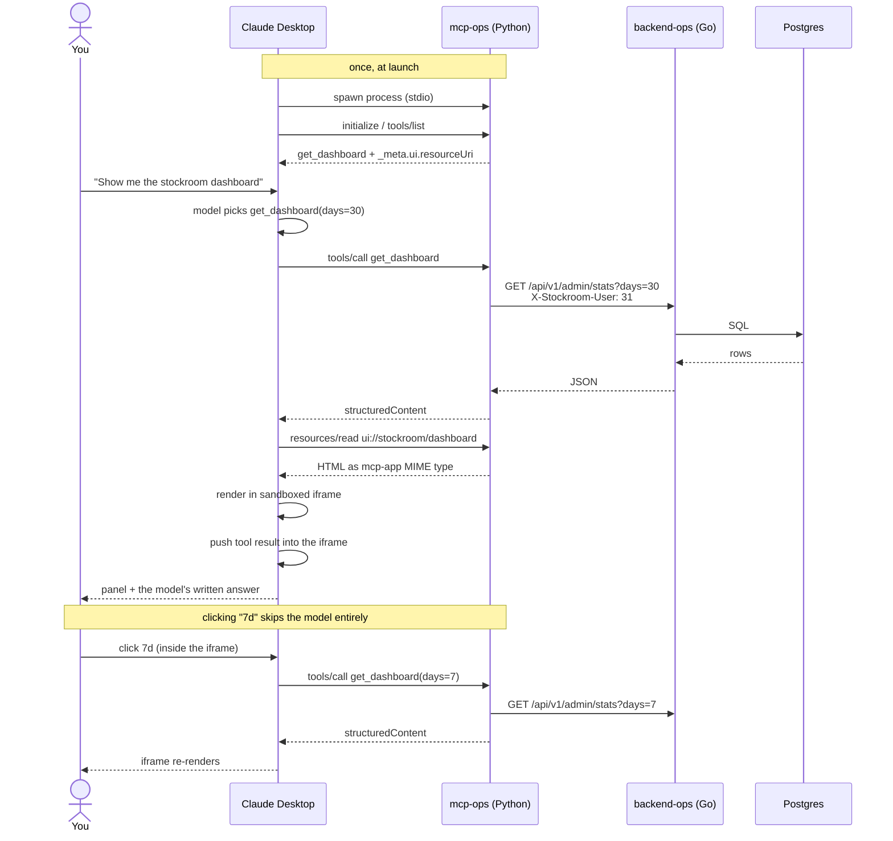

# From your prompt to the answer

What actually happens when you type *"Show me the stockroom dashboard"* into
Claude Desktop. Five processes are involved, and the interesting part is that
the panel you end up clicking talks to the server **without the model**.



---

## Step by step

### 0. At launch — Claude Desktop starts the server

Claude Desktop reads `claude_desktop_config.json` and **spawns the process
itself**, talking JSON-RPC over stdin/stdout. Nothing listens on a port for this
path.

It then performs `initialize` and asks `tools/list`, which comes back as:

```json
{
  "name": "get_dashboard",
  "annotations": { "readOnlyHint": true },
  "_meta": { "ui": { "resourceUri": "ui://stockroom/dashboard" } }
}
```

That `_meta.ui.resourceUri` is the whole MCP Apps mechanism: it tells the host
*this tool has a UI*. Without it, the tool would still work — the model would
just narrate numbers instead of showing a panel.

Set in [server.py](../mcp-ops/stockroom_ops/server.py) by the `@apps.tool(resource_uri=…)`
decorator.

### 1. You type a prompt

The model sees the tool's name, description, and schema. From *"Show me the
stockroom dashboard"* it decides to call `get_dashboard` and picks `days`
itself — which is why *"How is the shop doing this quarter?"* yields `days=90`.

**The model chooses. Nothing is hard-wired to your phrasing.**

### 2. Claude Desktop calls the tool

`tools/call` with `{"name": "get_dashboard", "arguments": {"days": 30}}` goes
down stdin to the Python process.

### 3. Python calls the Go API — as an admin

`mcp-ops` owns no data. It calls the Go service over HTTP
([api.py](../mcp-ops/stockroom_ops/api.py)):

```
GET /api/v1/admin/stats?days=30
X-Stockroom-User: 31
```

That header matters. On its first call, `_ensure_admin()` POSTs to
`/api/v1/login` with `admin@stockroom.local`, gets a `user_id`, and caches it.
Every later request carries it.

Without it, the Go service falls back to its default user — who is **not** an
admin — and `requireAdmin` in
[adminauth.go](../backend-ops/internal/httpapi/adminauth.go) returns `403`.

### 4. Go queries Postgres

`requireAdmin` re-reads `is_admin` from the database on every request (so
revoking admin takes effect immediately), then the handler runs the SQL and
returns JSON: totals, per-category counts, daily orders and revenue, top
products, price buckets.

### 5. Python returns a structured result

Because the tool is declared `structured_output=True`, the result carries
`structuredContent` — real JSON, not a stringified blob. The model can reason
over it, and the View can render it without parsing prose.

### 6. Claude Desktop fetches the UI

Seeing `_meta.ui.resourceUri`, the host calls `resources/read` for
`ui://stockroom/dashboard`. Python returns the HTML built from
[views/](../mcp-ops/views/), served as `text/html;profile=mcp-app` — hosts will
not render a `ui://` resource under any other MIME type.

**This is why the View is one self-contained file.** The iframe runs under a
deny-by-default CSP: no external scripts, styles, or fonts. `vite-plugin-singlefile`
inlines everything, which is why `dashboard.html` is ~400 KB.

### 7. The panel renders and receives the data

The host renders that HTML in a sandboxed iframe and **pushes the tool result
into it**. Inside, [dashboard.ts](../mcp-ops/views/src/dashboard.ts) is waiting:

```ts
const app = new App({ name: "Stockroom ops", version: "0.1.0" });
app.ontoolresult = (result) => render(readResult(result));
app.connect();
```

`ontoolresult` fires with the same payload the model got. The View draws six
tiles from it.

You now see two things: **the panel**, and the model's written answer — both from
one tool call.

### 8. Clicking inside the panel skips the model

This is the part worth understanding. The 7d/14d/30d/90d buttons call:

```ts
await app.callServerTool({ name: "get_dashboard", arguments: { days } });
```

That goes iframe → host → MCP server → Go API → Postgres and back, and the panel
re-renders. **The model is not involved** — no tokens, no latency, no chance of
it misreading a number.

Steps 3–5 repeat; steps 1, 2 and 6 do not.

---

## Who is allowed to do what

The iframe is sandboxed and cannot reach the network directly. It cannot call
the Go API, and it cannot read MinIO. Everything goes through the host, which
only forwards calls to tools the server declared.

```
iframe ──(host-mediated)──▶ MCP server ──HTTP──▶ Go API ──▶ Postgres / MinIO
```

Which is why every tool here is **read-only**. The catalog is crawled from a
live website, so product names and descriptions are text an attacker can
influence. If `cancel_order` were a tool, a crafted product description could
talk the model into calling it. Nothing exposed can mutate anything.

## Where each piece lives

| Step | Code |
|---|---|
| Tool + `ui://` resource | [mcp-ops/stockroom_ops/server.py](../mcp-ops/stockroom_ops/server.py) |
| Admin login + HTTP calls | [mcp-ops/stockroom_ops/api.py](../mcp-ops/stockroom_ops/api.py) |
| The panel | [mcp-ops/views/src/dashboard.ts](../mcp-ops/views/src/dashboard.ts) |
| Admin gate | [backend-ops/internal/httpapi/adminauth.go](../backend-ops/internal/httpapi/adminauth.go) |
| Identity resolver | [backend-ops/internal/httpapi/user.go](../backend-ops/internal/httpapi/user.go) |
| Stats SQL | [backend-ops/internal/store/admin.go](../backend-ops/internal/store/admin.go) |

## Two languages, on purpose

The **server** is Python because the MCP SDK supports Apps first-class
(`mcp.server.apps`). The **View** is TypeScript because it runs in the host's
browser iframe — that is browser JavaScript no matter what the server is
written in. `mcp-ops/views/` is not a second application; it is a build step
producing one HTML file the Python server hands to the host.

## When it goes wrong

| Symptom | Cause |
|---|---|
| Tool runs, answer is text, no panel | Host is not rendering `ui://`. The server is fine — check `_meta.ui.resourceUri` is present and the MIME type is `text/html;profile=mcp-app`. |
| `403 forbidden` | The admin email is not in `STOCKROOM_ADMIN_EMAILS` on the API, or the API was not restarted after adding it. |
| Empty panel, no error | The View bundle failed to build, or an asset was left external and blocked by CSP. Rebuild with `cd views && npm run build`. |
| Tool missing entirely | Claude Desktop was not fully quit (⌘Q) after editing its config, or a path in the config is not absolute. |
