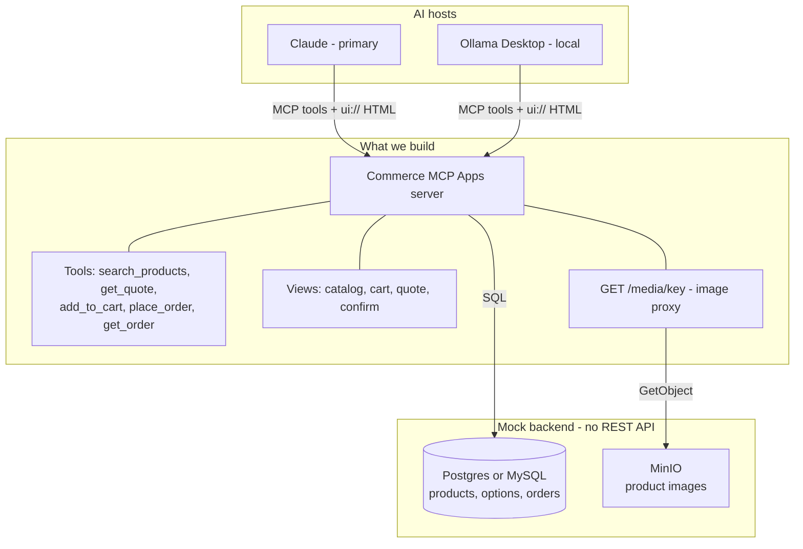
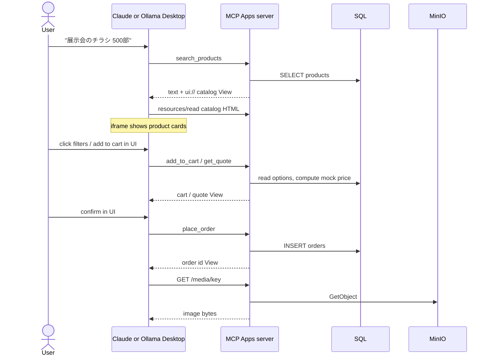

# RAKSUL Hack Week PoC — Conversational Commerce on MCP Apps

> **Hack Week PoC.** Interactive shopping UI inside the conversation. Hosts: **Claude** and **Ollama Desktop**. No public endpoints. No real checkout.

---

## Context

E-commerce purchase is still a website workflow (browse → spec → price → cart → pay). It has not become an **AI-native workflow**.

The goal is a **next-gen conversational shopping** experience: the user states a job in chat, and purchase steps happen **in the conversation** with interactive UI — not text-only Q&A, and not "open raksul.com."

This is a **PoC**. We do not ship a real store. We prove the workflow and the MCP contract.

### Product direction

- **MCP Apps**, not chat-only MCP: product cards, filters, spec/price forms, confirm — rendered in a sandboxed iframe inside the host.
- **Claude** is the primary host (documented MCP Apps support, web and desktop).
- **Ollama Desktop** is the local host (same MCP server, no cloud dependency for the demo machine).
- ZOZO in ChatGPT and ChatGPT Apps are **UX references** (conversation → cards). They are not the stack we ship.
- Closest build reference: the Classmethod MCP Apps EC sample (search → cards → cart → confirm), but **do not** copy its public Vercel deploy.

### Scope we build

- MCP Apps Views (HTML UI)
- One **commerce MCP server** (tools + `ui://` resources + image proxy)
- **Mock backend** = database schema + seed data + MinIO objects

### Out of scope

- raksul-core / real payment / SSO / full catalog
- A mock REST API (no extra HTTP CRUD service)
- Public internet endpoints (open ngrok, public Vercel, unauthenticated `*.run.app`)
- Gemini (dropped)
- go-db-mcp or any generic SQL MCP in front of the host

---

## Architecture

The AI host **only speaks MCP**. An existing DB is not MCP. MCP Apps is not a second server — it is UI **on** the commerce MCP server.

Claude Desktop and Ollama Desktop can both reach **localhost**, so the MCP server stays on the machine (or a private LAN). No public hostname required for the PoC.

### Layers

| Layer | Role |
|---|---|
| **Claude** | Primary host. Renders chat + MCP App iframe. Desktop can use localhost; Team/web needs a reachable private URL if not on the same machine. |
| **Ollama Desktop** | Local host. Same MCP server. Spike `ui://` View rendering on Day 0 — tool calling is not enough. |
| **Commerce MCP Apps server** | The only process the host connects to. Tools, `ui://` HTML, `GET /media/{key}`. |
| **Postgres / MySQL** | Mock catalog and mock orders. Tools run SQL. No mock REST API. |
| **MinIO** | Image bytes. DB stores `image_key`, not a public URL. |

### Images and the iframe sandbox

MCP App iframes often cannot fetch arbitrary hosts. Do not put raw MinIO URLs in ``.

1. Seed MinIO (`products/flyer-a4.jpg`, …).
2. DB column `image_key`.
3. MCP server proxies `GET /media/{key}` → MinIO (same origin as `/mcp`).
4. Views use `/media/...` (or data URIs for a tiny catalog).

### Request flow (golden path)

---

## Mock data model

Cart can stay **in memory** on the MCP server for the PoC. Persist catalog and orders in SQL.

| Table | Purpose |
|---|---|
| `products` | id, name, category, image_key, base_price |
| `product_options` | size, paper, qty rules |
| `orders` | Mock checkout writes from `place_order` |

---

## MCP tools and Views

| Tool | View |
|---|---|
| `search_products` | Product cards + filters |
| `get_quote` | Spec / price form |
| `add_to_cart` | Cart |
| `place_order` | Confirm (explicit click only — no silent checkout) |
| `get_order` | Order id / history |

Views are single-file HTML. The iframe calls tools via MCP JSON-RPC (`app.callServerTool()`). No `fetch` to raksul-core.

---

## Security (Hack Week)

- Bind the MCP server to **127.0.0.1**. Claude Desktop and Ollama Desktop run on the same machine.
- No public URL, no ngrok, no open Cloud Run.
- Mock catalog only. No customer PII.
- `place_order` only from the confirm View.
- MinIO is not public; only the MCP proxy reads it.

> ⚠️ **Ollama Desktop + MCP Apps:** confirm on Day 0 that Ollama Desktop renders `ui://` HTML iframes, not just tool text. If it does not, Claude is the live demo; Ollama stays a local tool-calling check.

---

## Demo bar

User: 「展示会のチラシ 500部、来週まで」 → cards + filters → mock price → confirm → mock order id **inside the chat**.

If any step requires opening raksul.com, the PoC failed.

---

## Tasks (2 developers)

**Dev A — MCP server + mock data.** Tools, SQL, MinIO, `/media` proxy.

**Dev B — MCP Apps Views + hosts.** Catalog/cart/quote/confirm UI, Claude + Ollama Desktop wiring, demo script.

Contract they share from Day 0: tool names, JSON schemas, `ui://` resource URIs. Views only call tools; they never touch SQL or MinIO.

### Shared — Day 0 (pair, half day)

- [ ] Repo scaffold: MCP server, `views/`, docker-compose for Postgres + MinIO, bind `127.0.0.1`
- [ ] Hello-world MCP App: one tool + one `ui://` View (a button that calls a tool)
- [ ] Claude Desktop/Team: confirm iframe renders and `app.callServerTool()` works
- [ ] Ollama Desktop: confirm `ui://` iframe (if no, Claude is the live demo; Ollama = tools only)
- [ ] Freeze the contract below (do not change names mid-week)

| Tool | `ui://` View | Owner after Day 0 |
|---|---|---|
| `search_products` | `ui://raksul/catalog` | A schema / B UI |
| `get_quote` | `ui://raksul/quote` | A schema / B UI |
| `add_to_cart` | `ui://raksul/cart` | A schema / B UI |
| `place_order` | `ui://raksul/confirm` | A schema / B UI |
| `get_order` | `ui://raksul/order` | A schema / B UI |

---

### Dev A — MCP server + data

#### A1. Mock backend

- [ ] Postgres schema: `products`, `product_options`, `orders`
- [ ] Seed ~8–12 print SKUs (チラシ + 名刺 is enough) with `image_key`
- [ ] MinIO bucket + seed images; no public policy
- [ ] MCP process: `GET /media/{key}` → MinIO `GetObject` (same origin as `/mcp`)

#### A2. Tools (SQL in the MCP server, no REST API)

- [ ] Streamable HTTP `/mcp` on `127.0.0.1` (stdio optional for Claude Desktop)
- [ ] `search_products` — query + `_meta.ui.resourceUri` → catalog View
- [ ] `get_quote` — spec/qty → mock price
- [ ] `add_to_cart` — in-memory cart
- [ ] `place_order` — `INSERT orders`; reject unless called from confirm View
- [ ] `get_order` — by mock order id
- [ ] Register `ui://` HTML resources (Dev B drops in built single-file HTML)

#### A3. Host + security (A owns server config)

- [ ] Cursor/Claude `mcp.json` example for `http://127.0.0.1:<port>/mcp`
- [ ] Confirm bind is loopback only; MinIO not published

---

### Dev B — Views + hosts

#### B1. Views (React → single-file HTML, Classmethod pattern)

- [ ] Shared styles (cards, filters, form, primary button)
- [ ] Catalog: product cards, image via `/media/{key}`, filters, add-to-cart
- [ ] Quote: paper/size/qty → show mock price
- [ ] Cart drawer/page + totals
- [ ] Confirm: explicit 「注文する」→ `place_order`
- [ ] Order: show mock order id
- [ ] All actions via `app.callServerTool()` — no `fetch` to RAKSUL or MinIO

#### B2. Hosts + demo

- [ ] Claude: golden-path walkthrough (iframe, not text-only)
- [ ] Ollama Desktop: same path, or document "tools only" if no iframe
- [ ] 2–3 min demo script: 「展示会のチラシ 500部、来週まで」
- [ ] Backup recording (Claude Desktop) if the live host fails

---

### Shared — integrate and close

- [ ] Wire Views into A's `resources/read` so Claude shows cards end-to-end
- [ ] Golden path: search → filter → quote → cart → confirm → order id
- [ ] Images load in the iframe via `/media`
- [ ] Outside localhost: connection refused / 403
- [ ] One-pager: APIs we would need later vs what stayed mocked

---

### Suggested calendar

| When | Dev A — server + data | Dev B — Views + hosts |
|---|---|---|
| **Day 0** | Pair: scaffold, hello-world App, Claude + Ollama spike, freeze tool contract | Pair (same) |
| **Day 1** | Schema, seed, MinIO, `/media`, `search_products` | Shared styles; catalog View against A's stubbed tool output |
| **Day 2** | `get_quote`, cart, `place_order` / `get_order` | Quote form + cart View; every action through `app.callServerTool()` |
| **Day 3** | Plug B's HTML into `ui://` resources, host config | Confirm + order Views; hand built single-file HTML to A |
| **Day 4–5** | Pair: e2e, images, security pass, demo script, one-pager | Pair: same, plus demo script and backup recording |

---

## References

- [MCP Apps overview](https://modelcontextprotocol.io/extensions/apps/overview) and [build guide](https://modelcontextprotocol.io/extensions/apps/build)
- [Apps specification 2026-01-26](https://github.com/modelcontextprotocol/ext-apps/blob/main/specification/2026-01-26/apps.mdx) — CSP defaults, `ui/` methods, visibility
- [MCP Apps launch post](https://blog.modelcontextprotocol.io/posts/2026-01-26-mcp-apps/)
- [Extension support matrix](https://modelcontextprotocol.io/extensions/client-matrix) — **the host list of record. Check it before committing to a host.**
- Classmethod: [MCP Apps EC shop](https://dev.classmethod.jp/articles/mcp-apps-ec-shops/) and [trying more Apps SDK features on it](https://dev.classmethod.jp/articles/mcp-apps-sdk-try/)
- [ext-apps examples](https://github.com/modelcontextprotocol/ext-apps/tree/main/examples) — including `basic-host`, the local test host
- [ZOZO: Apps in ChatGPT press release](requirement.md) (in this repo) — UX reference only